VEESA R Package
================

<!-- badges: start -->

[](https://CRAN.R-project.org/package=veesa)
[](https://github.com/sandialabs/veesa/actions/workflows/R-CMD-check.yaml)
<!-- badges: end -->

# Set Up

``` r
# Load R packages
library(cowplot)
library(dplyr)
library(ggplot2)
library(purrr)
library(randomForest)
library(tidyr)
library(veesa)

# Specify a color palette
color_pal = wesanderson::wes_palette("Zissou1", 5, type = "continuous")

# Specify colors for PC direction plots
col_plus1 = "#784D8C"
col_plus2 = "#A289AE"
col_minus1 = "#EA9B44"
col_minus2 = "#EBBC88"
col_pcdir_1sd = c(col_plus1, "black", col_minus1)
col_pcdir_2sd = c(col_plus2, col_plus1, "black", col_minus1, col_minus2)
```

# Data Simulation

Simulate data:

``` r
sim_data = simulate_functions(M = 100, N = 75, seed = 20211130)
```

Separate data into training/testing:

``` r
set.seed(20211130)
id = unique(sim_data$id)
M_test = length(id) * 0.25
id_test = sample(x = id, size = M_test, replace = F)
sim_data = sim_data %>% mutate(data = ifelse(id %in% id_test, "test", "train"))
```

Simulated functions colored by covariates:

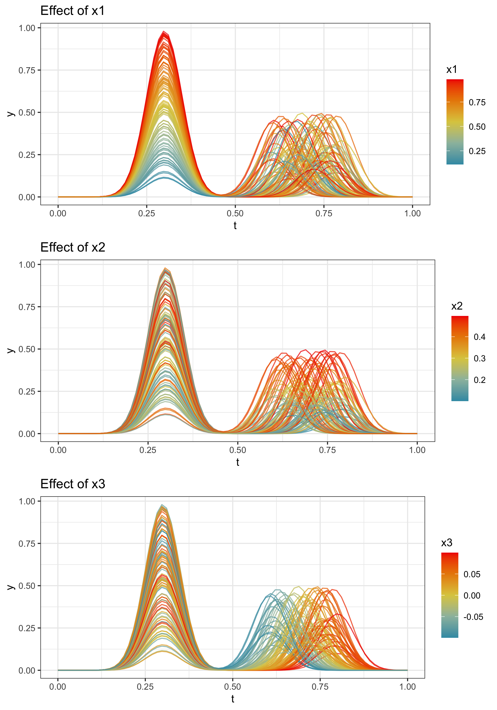<!-- -->

Prepare matrices from the data frames:

``` r
prep_matrix <- function(df, train_test) {
  df %>%
    filter(data == train_test) %>%
    select(id, t, y) %>%
    ungroup() %>%
    pivot_wider(id_cols = t,
                names_from = id,
                values_from = y) %>%
    select(-t) %>%
    as.matrix()
}

sim_train_matrix = prep_matrix(df = sim_data, train_test = "train")
sim_test_matrix = prep_matrix(df = sim_data, train_test = "test")
```

Create a vector of times:

``` r
times = sim_data$t %>% unique()
```

# Alignment and fPCA

Prepare train data

``` r
train_transformed_jfpca <-
  prep_training_data(
    f = sim_train_matrix,
    time = times, 
    fpca_method = "jfpca",
    optim_method = "DPo"
  )

train_transformed_vfpca <-
  prep_training_data(
    f = sim_train_matrix,
    time = times, 
    fpca_method = "vfpca",
    optim_method = "DPo"
  )

train_transformed_hfpca <-
  prep_training_data(
    f = sim_train_matrix,
    time = times, 
    fpca_method = "hfpca",
    optim_method = "DPo"
  )
```

Prepare test data:

``` r
test_transformed_jfpca <-
  prep_testing_data(
    f = sim_test_matrix,
    time = times,
    train_prep = train_transformed_jfpca,
    optim_method = "DPo"
  )

test_transformed_vfpca <-
  prep_testing_data(
    f = sim_test_matrix,
    time = times,
    train_prep = train_transformed_vfpca,
    optim_method = "DPo"
  )

test_transformed_hfpca <-
  prep_testing_data(
    f = sim_test_matrix,
    time = times,
    train_prep = train_transformed_hfpca,
    optim_method = "DPo"
  )
```

Plot several PCs:

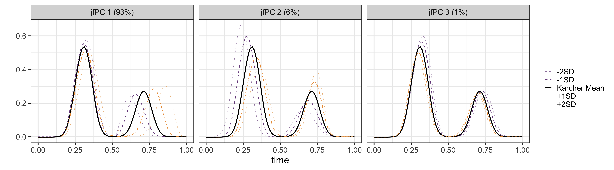<!-- -->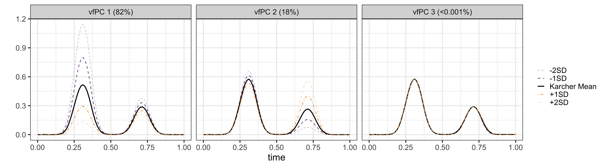<!-- -->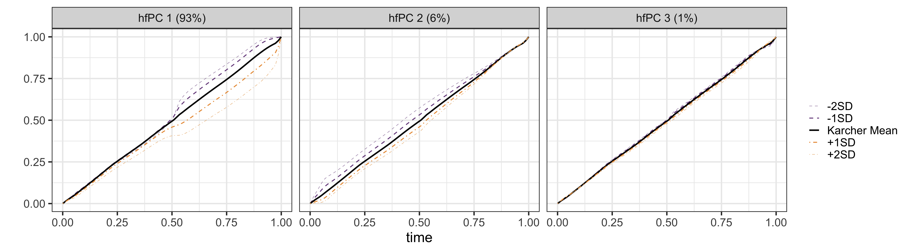<!-- -->

Compare jfPCA coefficients from train and test data:

<!-- -->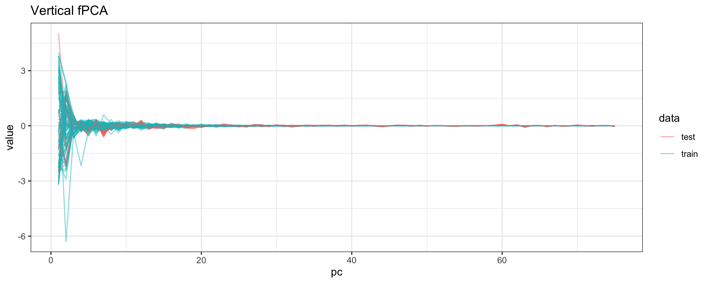<!-- -->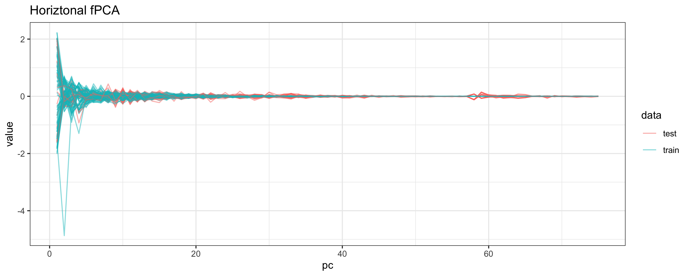<!-- -->

# Models

Create response variable:

``` r
x1_train <- 
  sim_data %>% filter(data == "train") %>%
  select(id, x1) %>%
  distinct() %>% 
  pull(x1)
```

Create data frames with PCs and response for random forest:

``` r
rf_jfpca_df <- 
  train_transformed_jfpca$fpca_res$coef %>%
  data.frame() %>%
  rename_all(.funs = function(x) stringr::str_replace(x, "X", "pc")) %>%
  mutate(x1 = x1_train) %>%
  select(x1, everything())

rf_vfpca_df <- 
  train_transformed_vfpca$fpca_res$coef %>%
  data.frame() %>%
  rename_all(.funs = function(x) stringr::str_replace(x, "X", "pc")) %>%
  mutate(x1 = x1_train) %>%
  select(x1, everything())

rf_hfpca_df <- 
  train_transformed_hfpca$fpca_res$coef %>%
  data.frame() %>%
  rename_all(.funs = function(x) stringr::str_replace(x, "X", "pc")) %>%
  mutate(x1 = x1_train) %>%
  select(x1, everything())
```

Fit random forests:

``` r
set.seed(20211130)
rf_jfpca = randomForest(x1 ~ ., data = rf_jfpca_df)
rf_vfpca = randomForest(x1 ~ ., data = rf_vfpca_df)
rf_hfpca = randomForest(x1 ~ ., data = rf_hfpca_df)
```

# PFI

Compute PFI:

``` r
set.seed(20211130)
pfi_jfpca = compute_pfi(x = rf_jfpca_df %>% select(-x1), y = rf_jfpca_df$x1, f = rf_jfpca, K = 10, metric = "nmse")
pfi_vfpca = compute_pfi(x = rf_vfpca_df %>% select(-x1), y = rf_vfpca_df$x1, f = rf_vfpca, K = 10, metric = "nmse")
pfi_hfpca = compute_pfi(x = rf_hfpca_df %>% select(-x1), y = rf_hfpca_df$x1, f = rf_hfpca, K = 10, metric = "nmse")
```

PFI results (mean of reps):

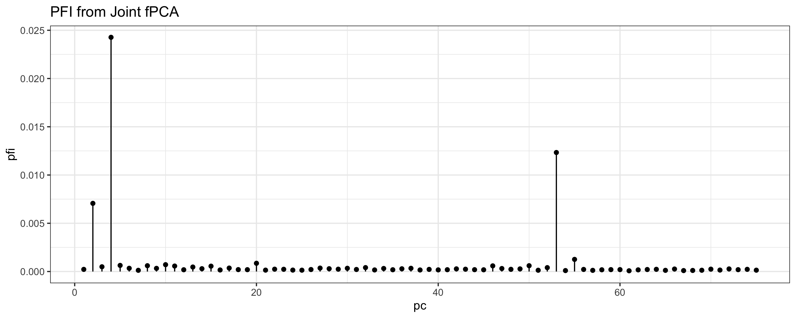<!-- --><!-- -->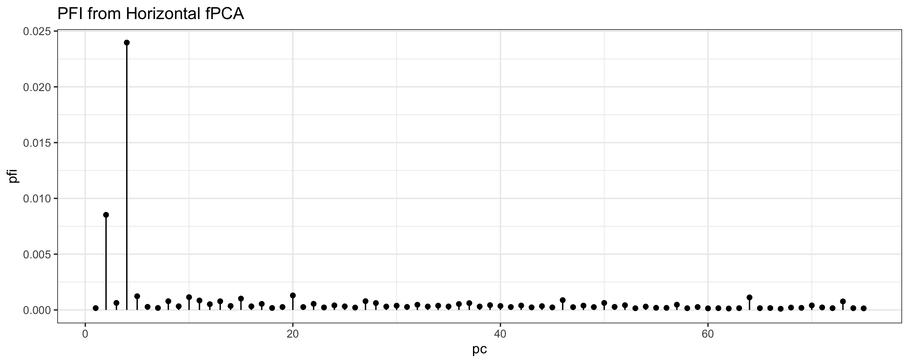<!-- -->

PFI results (variability across reps):

<!-- --><!-- -->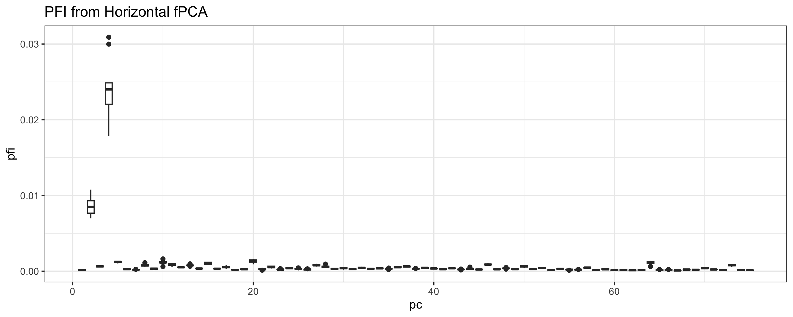<!-- -->

Identify the top PC for each elastic fPCA method:

``` r
top_pc_jfpca <- 
  data.frame(pfi = pfi_jfpca$pfi) %>%
  mutate(pc = 1:n()) %>%
  arrange(desc(pfi)) %>%
  slice(1) %>%
  pull(pc)

top_pc_vfpca <- 
  data.frame(pfi = pfi_vfpca$pfi) %>%
  mutate(pc = 1:n()) %>%
  arrange(desc(pfi)) %>%
  slice(1) %>%
  pull(pc)

top_pc_hfpca <- 
  data.frame(pfi = pfi_hfpca$pfi) %>%
  mutate(pc = 1:n()) %>%
  arrange(desc(pfi)) %>%
  slice(1) %>%
  pull(pc)
```

Principal directions of top PC for each jfPCA method:

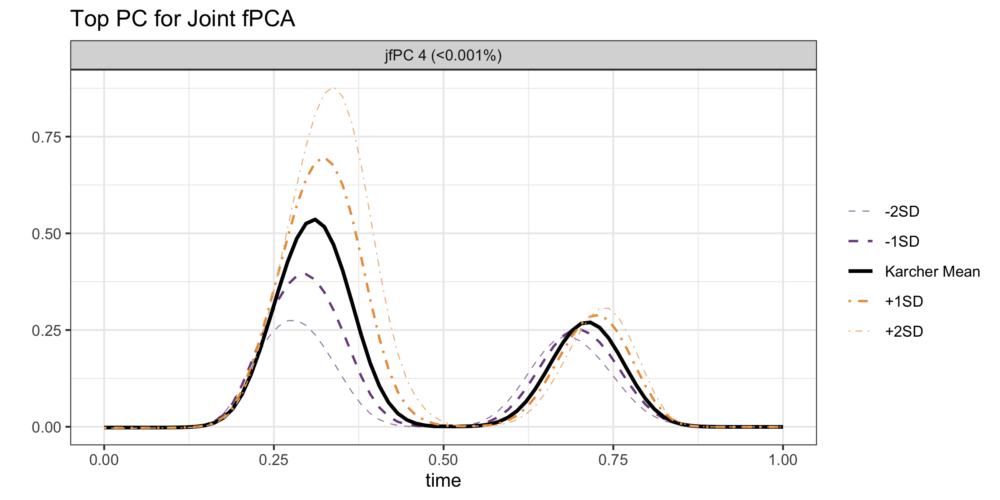<!-- -->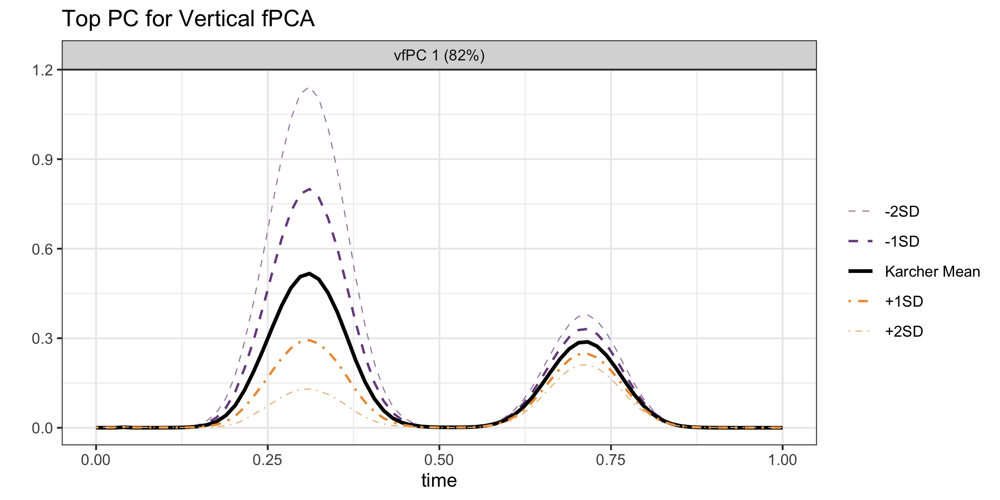<!-- -->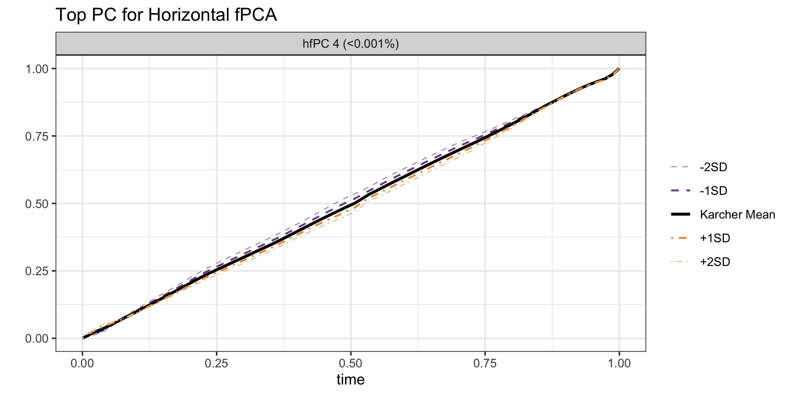<!-- -->

# Comparing Centered versus Not-Centered Warping Functions

Apply alignment to jfPCA principal directions:

``` r
train_transformed_jfpca_centered = center_warping_funs(train_obj = train_transformed_jfpca)
```

Warping functions before/after centering:

<!-- --><!-- -->

Aligned functions before/after centering:

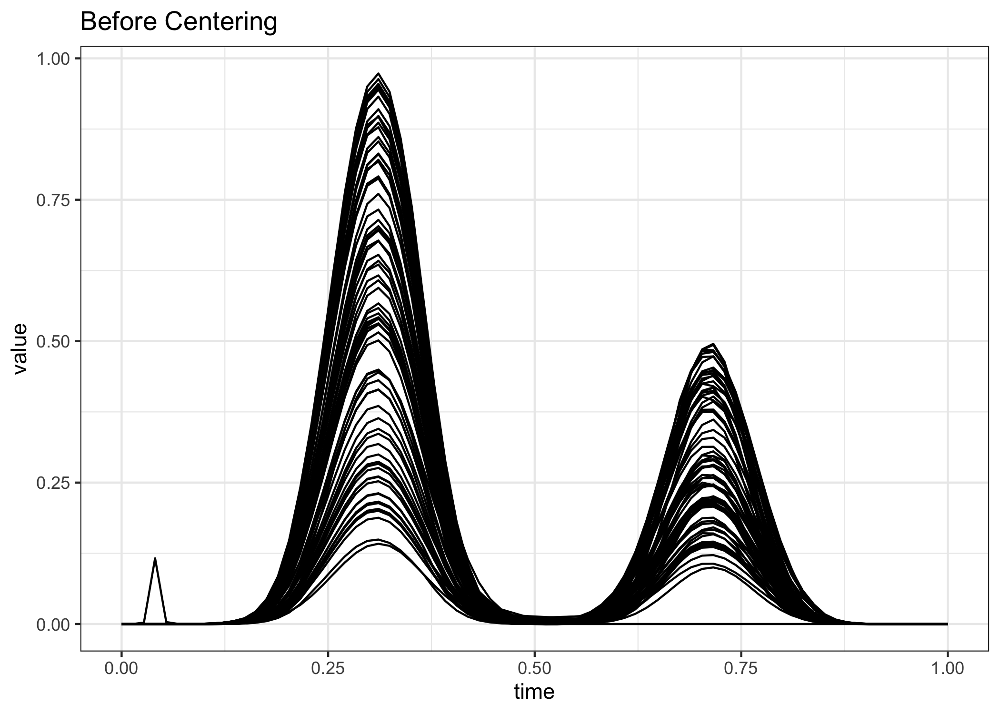<!-- --><!-- -->

# Comparing Aligned vs Not-Aligned jfPCA PC Directions

Apply alignment to jfPCA principal directions:

``` r
jfpca_pcdirs_aligned = align_pcdirs(train_obj = train_transformed_jfpca)
```

Joint:

<!-- -->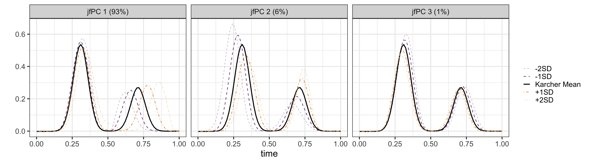<!-- -->
