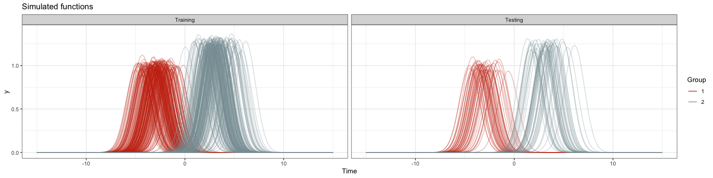

Shifted Peaks Data
================

Load packages:

``` r
library(dplyr)
library(ggplot2)
library(purrr)
```

Specify parameters:

``` r
z1 = 1; z1_sd = 0.05; a1 = -3; a1_sd = 1
z2 = 1.25; z2_sd = 0.05; a2 = 3; a2_sd = 1
```

Specify the times:

``` r
times = seq(-15, 15, length.out = 150)
```

Functions:

``` r
# Function for simulating data
generate_data = function(id, group, t) {
  if (group == 1) {
    z = rnorm(1, z1, z1_sd)
    a = rnorm(1, a1, a1_sd)
  }
  if (group == 2) { 
    z = rnorm(1, z2, z2_sd)
    a = rnorm(1, a2, a2_sd)
  }
  y = z * exp((-((t - a)^2)) / 2)
  
  data.frame(id, group = as.character(group), index = 1:length(t), t, y)
}

# Function for generating true means
true_mean = function(group, t) {
  if (group == 1) {
   z = z1
   a = a1 
  }
  if (group == 2) {
    z = z2
    a = a2
  }
  y = z * exp((-((t - a)^2)) / 2)
  data.frame(group = as.character(group), index = 1:length(t), t, y)
}
```

Specify the sample sizes:

``` r
ntrain = 400
ntest = 100
n = ntrain + ntest
```

Simulate data:

``` r
set.seed(20211027)
shifted_peaks <-
  map2_df(
    .x = 1:n,
    .y = c(rep(1:2, each = n / 2)),
    .f = generate_data,
    t = times
  )
```

Randomly select ids from the simulated data for the training data:

``` r
train_ids = sample(unique(shifted_peaks$id), ntrain, F)
```

Add training/testing variable:

``` r
shifted_peaks <- 
  shifted_peaks |>
  mutate(data = ifelse(id %in% train_ids, "Training", "Testing")) |>
  select(data, id, group, everything()) |>
  mutate(data = forcats::fct_relevel(data, "Training", "Testing")) |>
  mutate(group = factor(group))
```

Plot of the data:

``` r
ggplot(shifted_peaks, aes(x = t, y = y, color = group, group = id)) +
  geom_line(alpha = 0.35) +
  facet_grid(. ~ data) +
  theme_bw() +
  scale_color_manual(values = wesanderson::wes_palettes$Royal1[2:1]) +
  ylim(0, 1.4) + 
  guides(color = guide_legend(override.aes = list(alpha = 1))) +
  labs(
    color = "Group",
    title = "Simulated functions",
    x = "Time",
    y = "y"
  )
```



Save the simulated data:

``` r
save(shifted_peaks, file = "../../data/shifted_peaks.rda")
```
